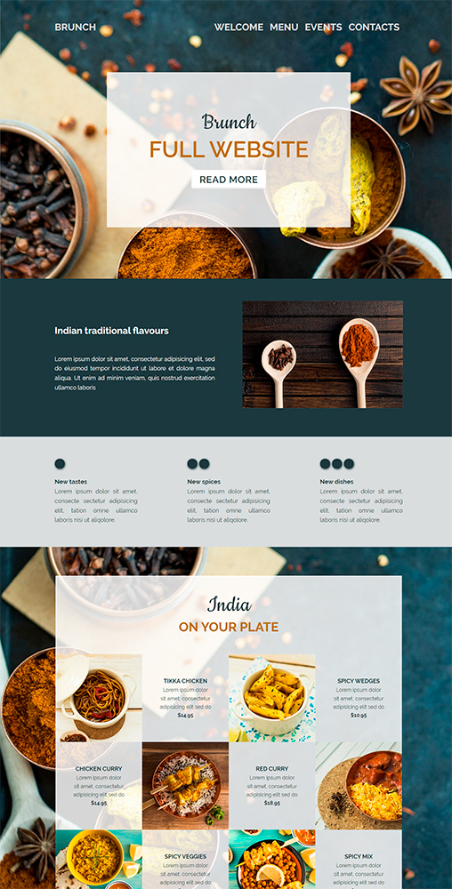
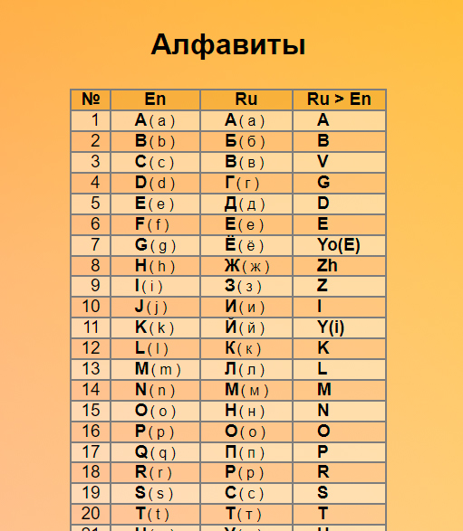
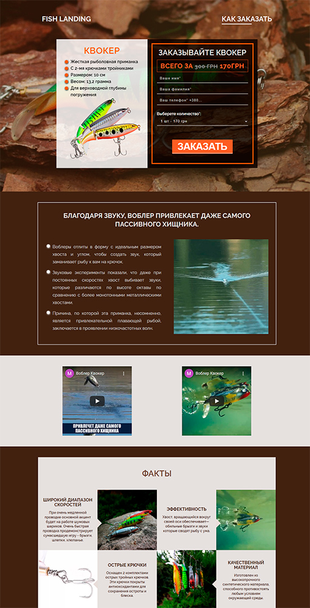
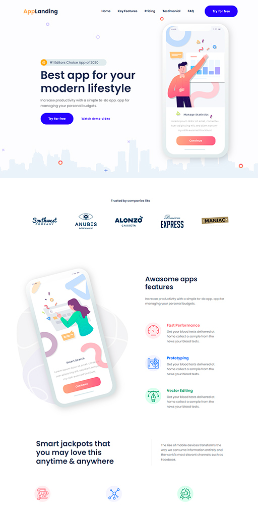

# Projects sites

<table align="center">
  <thead>
    <tr>
      <th align="center">
        Preview
      </th>
      <th align="center">
        Link to result
      </th>
      <th align="center">
        <!-- _______·Type·_______ -->
        Type
      </th>
    </tr>
  </thead>
  <tbody>
    <!-- site 👇 -->
    <tr>
      <!-- td 🔳 -->
      <td align="center" colspan="1" rowspan="2">
        
      </td>
      <!-- td 🔳 -->
      <td rowspan="2">
        <a href="https://awake-coding.github.io/brunch/" rel="nofollow">
          Brunch
        </a>
      </td>
      <!-- td 🔳 -->
      <td align="center">Landing</td>
    </tr>
    <!-- 🔴 row 2 -->
    <tr>
      <td align="center">
        <!-- 12 sections -->
        <!-- —:point_up_2:— -->
        ← <a href="brunch/#brunch-project-open_file_folder" rel="nofollow">
          Readme :high_brightness:
        </a>
      </td>
    </tr>
    <!-- site 👇 -->
    <tr>
      <!-- td 🔳 -->
      <td align="center" colspan="1" rowspan="2">
        
      </td>
      <!-- td 🔳 -->
      <td rowspan="2">
        <a href="https://awake-coding.github.io/alphabet/" rel="nofollow">
          Alphabet
        </a>
      </td>
      <!-- td 🔳 -->
      <td align="center">JS</td>
    </tr>
    <!-- 🔴 row 2 -->
    <tr>
      <td align="center">
        <!-- 2 sections -->
        <!-- —:point_up_2:— -->
        ← <a href="alphabet/#alphabet-project-open_file_folder" rel="nofollow">
          Readme :high_brightness:
        </a>
      </td>
    </tr>
    <!-- site 👇 -->
    <tr>
      <!-- td 🔳 -->
      <td align="center" colspan="1" rowspan="2">
        
      </td>
      <!-- td 🔳 -->
      <td rowspan="2">
        <a href="https://awake-coding.github.io/black-white-landing/" rel="nofollow">
          Black-white-landing
        </a>
      </td>
      <!-- td 🔳 -->
      <td align="center">Landing</td>
    </tr>
    <!-- 🔴 row 2 -->
    <tr>
      <td align="center">
        <!-- 5 sections -->
        <!-- —:point_up_2:— -->
        ← <a href="black-white-landing/#black-white-landing-project-open_file_folder" rel="nofollow">
          Readme :high_brightness:
        </a>
      </td>
    </tr>
    <!-- site 👇 -->
    <tr>
      <!-- td 🔳 -->
      <td align="center" colspan="1" rowspan="2">
        
      </td>
      <!-- td 🔳 -->
      <td rowspan="2">
        <a href="https://awake-coding.github.io/fish-landing/" rel="nofollow">
          Fish-landing
        </a>
      </td>
      <!-- td 🔳 -->
      <td align="center">Landing</td>
    </tr>
    <!-- 🔴 row 2 -->
    <tr>
      <td align="center">
        <!-- 7 sections -->
        <!-- —:point_up_2:— -->
        ← <a href="fish-landing/#fish-landing-project-open_file_folder" rel="nofollow">
          Readme :high_brightness:
        </a>
      </td>
    </tr>
    <!-- site 👇 -->
    <tr>
      <!-- td 🔳 -->
      <td align="center" colspan="1" rowspan="2">
        
      </td>
      <!-- td 🔳 -->
      <td rowspan="2">
        <a href="https://awake-coding.github.io/app-landing/" rel="nofollow">
          App-landing
        </a>
      </td>
      <!-- td 🔳 -->
      <td align="center">Landing</td>
      <!-- 🔴 row 2 -->
      <tr>
        <td align="center">
          <!-- 12 sections -->
          <!-- —:point_up_2:— -->
          ← <a href="app-landing/#app-landing-project-open_file_folder" rel="nofollow">
            Readme :high_brightness:
          </a>
        </td>
      </tr>
    </tr>
    <!-- site 👇 -->
  </tbody>
</table>

  ### Languages and Tools:
  - In projects (app-landing, black-white-landing, brunch, fish-landing):
      - 
      
      
      
      

      - 
      
      
      
      

      - 
      
      

      - 
      
      
      

<!-- 👇👇 -->
<!-- 

  

    Main info :point_left:
  

  
 11111 

 -->

 

## Browsers support
##### (except "Alphabet" - project)

<table align="center">
  <thead>
    <tr>
      <th>
        
         
        Chrome
      </th>
      <th>
        
         
        Firefox
      </th>
      <th>
        
         
        Safari
      </th>
      <th>
        
         
        IE/Edge
      </th>
    </tr>
  </thead>
  <tbody>
    <tr>
      <td>last 25 versions</td>
      <td>last 25 versions</td>
      <td>last 25 versions</td>
      <td>IE11, Edge</td>
    </tr>
  </tbody>
</table>
