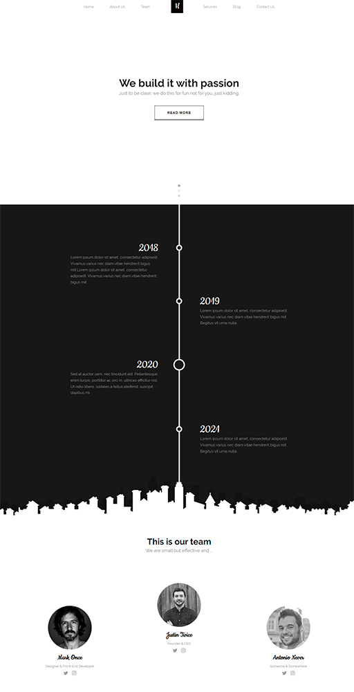

# Black-white-landing (project) :open_file_folder:


English | [Русский](README.ru.md)
<hr>


<!-- table site Preview -->
<table align="">
  <thead>
    <tr>
      <th align="center">
        Preview
      </th>
      <th align="center">
        Name project
      </th>
      <th align="center">
        Type
      </th>
    </tr>
  </thead>
  <tbody>
    <!-- site 👇 -->
    <tr>
      <!-- td 🔳 -->
      <td align="center" colspan="1" rowspan="2">
        <a href="https://awake-coding.github.io/black-white-landing/" rel="nofollow">
          
        </a>
      </td>
      <!-- td 🔳 -->
      <td rowspan="2">
        <a href="https://awake-coding.github.io/black-white-landing/" rel="nofollow">
          Black-white-landing
        </a>
      </td>
      <!-- td 🔳 -->
      <td align="center">Landing</td>
    </tr>
    <!-- 🔴 row 2 -->
    <tr>
      <td align="center">
        <!-- 5 sections -->
        —:point_up_2:—
      </td>
    </tr>
    <!-- site 👇 -->
  </tbody>
</table><br>


I used and made:
  - ### HTML
      - Valid HTML-code
  - ### SASS - CSS
      - Responsive for any screen resolution
      - Flexbox - the basis for project layout management
      - Gulp compiles SASS to CSS by tracking "sourcemaps" (which makes debugging easier for SASS)
      - File "[_config.sass](sass/_config.sass)"
          - [VARs](sass/_config.sass#L49) in SASS (font, color)
          - [```@font-face``` mixin](sass/_config.sass#L6-L20)
          - [```@media``` mixin](sass/_config.sass#L24-L45)
              1. specifying min and max widths via: ```@include media($min-w: null, $max-w: null)```
              2. Instead of "```null```" passed value in ```px``` or ```em```
          - Default CSS:
              1. Reset CSS for: ```*, ul, li, ol, a```
              2. Default CSS for: ```body, header, section, input, textarea, ::placeholder, ::selection, b, strong, address, .h1, .h2, .h3, .h4, .h5```
              3. CSS for classes: ```.container```, ```.button```
      - File "[libs.sass](sass/libs.sass)"
          - [CSS libraries included](sass/libs.sass#L1) in libs.sass,
          - [Included in HTML](index.html#L23) as separate "libs.min.css" file
      - File "[main.sass](sass/main.sass)"
          - Included "_config.sass" by writing ```@import "_config"```, then VS-Code will prompt the variables of the included SASS file.
          - All ```@media``` I written under the necessary classes for adaptive in "main.sass", using the SASS syntax feature
  - ### JS
      - Main js file: "[main.js](js/main.js)"
      - js is built using webpack, which is used in gulp
      - Compiling Webpack to ES5 with ```@babel/preset-env```
      - Sourcemaps in gulp produce ease of JS debugging
      - Code disabled when all HTML has been fully loaded "DOMContentLoaded"
      - Libraries are included in "[main.js](js/main.js)" itself, via ```const nameVAR = require('~/app/')```
      - **Bugs/Solutions**:
          1. To make the jQuery smooth transition work, I removed the following from SASS: ```html { scroll-behavior: smooth; }```
  - ### [Fonts/](fonts)
      - Fonts with extensions .woff, .woff2, .svg are used
  - ### [Image/](image)
      - src/ - originals with layout
      - dist/ - optimized images with gulp
  - ### [.htaccess](.htaccess)
      - Apache web server configuration file, for caching fonts, images, CSS, JS, HTML


  - ### Browsers support

<table align="">
  <thead>
    <tr>
      <th>
        <a rel="nofollow" target="_blank">
          
        </a>
        <br>
        Chrome
      </th>
      <th>
        <a rel="nofollow" target="_blank">
          
        </a>
        <br>
        Firefox
      </th>
      <th>
        <a rel="nofollow" target="_blank">
          
        </a>
        <br>
        Safari
      </th>
      <th>
        <a rel="nofollow" target="_blank">
          
        </a>
        <br>
        IE/Edge
      </th>
    </tr>
  </thead>
  <tbody>
    <tr>
      <td>last 25 versions</td>
      <td>last 25 versions</td>
      <td>last 25 versions</td>
      <td>IE11, Edge</td>
    </tr>
  </tbody>
</table>