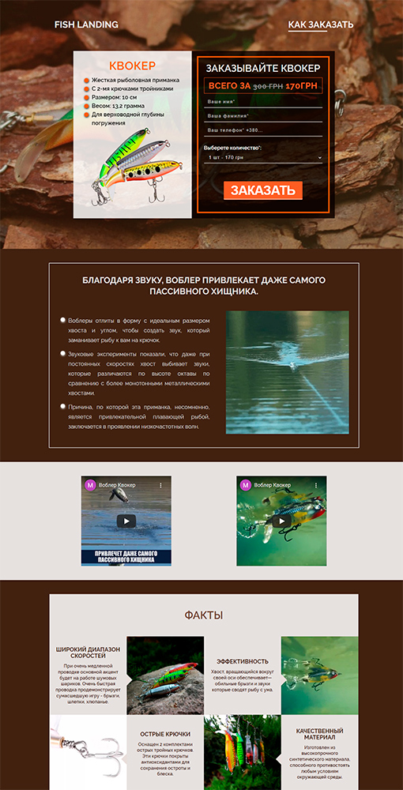

# Fish-landing (project) :open_file_folder:


English | [Русский](README.ru.md)
<hr>


<!-- table site Preview -->
<table align="">
  <thead>
    <tr>
      <th align="center">
        Preview
      </th>
      <th align="center">
        Name project
      </th>
      <th align="center">
        Type
      </th>
    </tr>
  </thead>
  <tbody>
    <!-- site 👇 -->
    <tr>
      <!-- td 🔳 -->
      <td align="center" colspan="1" rowspan="2">
        <a href="https://awake-coding.github.io/fish-landing/" rel="nofollow">
          
        </a>
      </td>
      <!-- td 🔳 -->
      <td rowspan="2">
        <a href="https://awake-coding.github.io/fish-landing/" rel="nofollow">
          Fish-landing
        </a>
      </td>
      <!-- td 🔳 -->
      <td align="center">Landing</td>
    </tr>
    <!-- 🔴 row 2 -->
    <tr>
      <td align="center">
        <!-- 7 sections -->
        —:point_up_2:—
      </td>
    </tr>
    <!-- site 👇 -->
  </tbody>
</table><br>


I used and made:
  - ### HTML
      - Valid HTML-code
      - Specified a ban on indexing by search engines (```<meta name="robots" content="noindex, nofollow">```)
      - favicon:
          - Plain favicon.ico, 30x30
      - Links:
          - Added ```target="_blank"``` and ```rel="noopener"``` to each link that leads to another site
          - Each such link will more safely open the site in a new tab
      - Video youtube
          - "enhanced privacy mode" was enabled for YouTube video, now there are fewer errors in the console
          - The essence of the change: replacing the domain of embedded videos from the standard ```www.youtube.com``` to ```www.youtube-nocookie.com```
          - documentation about it: [Turn on privacy-enhanced mode](https://support.google.com/youtube/answer/171780?hl=en#:~:text=Turn%20on%20privacy%2Denhanced%20mode)
      - Gif to MP4
          - "Fish_info2.gif" and "Fish_info5.gif", the weight of these gifs was too large, and they were not properly optimized by gulp, so the following actions were taken:
              1. Converted all Gif to MP4
              2. MP4s are noticeably smaller (Tip from web.dev: [Replace animated GIFs](https://web.dev/replace-gifs-with-videos/))
          - Connected via ```<video>```
          - Set attributes ```autoplay loop muted playsinline```
              1. ```autoplay``` does not work without ```muted```
              2. Firefox may automatically block autoplay video (video autoplay), so posters of these video-gifs were made in JPEG format and included in ```<video>``` via the ```poster=""``` attribute
  - ### SASS (CSS)
      - Responsive for any screen resolution
      - Flexbox - the basis for project layout management
      - Gulp compiles SASS to CSS by tracking "sourcemaps" (which makes debugging easier for SASS)
      - File "[_config.sass](sass/_config.sass)" contains:
          - [VARs](sass/_config.sass#L49) in SASS (font, color)
          - [```@font-face``` mixin](sass/_config.sass#L6-L20)
          - [```@media``` mixin](sass/_config.sass#L24-L45)
              1. specifying min and max widths via: ```@include media($min-w: null, $max-w: null)```
              2. Instead of "```null```" passed value in ```px``` or ```em```
          - Default CSS:
              1. Reset CSS for: ```*, ul, li, ol, a```
              2. Default CSS for: ```body, header, section, input, textarea, ::placeholder, ::selection, b, strong, address, .h1, .h2, .h3, .h4, .h5```
              3. CSS for classes: ```.container```, ```.circle```, ```.button```
      - File "[libs.sass](sass/libs.sass)" contains:
          - [Included CSS libraries](sass/libs.sass#L1):
              1. animate.css (animate for [.header__center--properties](index.html#L60))
              2. font-awesome.css
          - [Connected in HTML](index.html#L23) as separate "libs.min.css" file
      - File "[main.sass](sass/main.sass)" contains:
          - included "_config.sass" by writing ```@import "_config"```, then VS-Code will prompt the variables of the included SASS file
          - ```@media``` under required classes in "main.sass" using the SASS syntax opportunity
  - ### JS
      - Main js file: "[main.js](js/main.js)"
      - js is built using Webpack, which is used in gulp
      - Compiling Webpack to ES5 with ```@babel/preset-env```
      - Sourcemaps in gulp produce ease of JS debugging
      - The code will start executing when all the HTML has been completely loaded "DOMContentLoaded"
      - Libraries are included in "[main.js](js/main.js)" itself, via ```const nameVAR = require('~/app/')```:
          1. jQuery (for a smooth anchor transition)
               ```const jQuery = require('~/app/libs/jquery3.5.1/dist/jquery.min')```;
      - **Bugs/Solutions**:
          1. To make the jQuery smooth transition work, I removed the following from SASS: ```html { scroll-behavior: smooth; }```
  - ### Icons
      - ```Font Awesome```
  - ### [Fonts/](fonts)
      - Fonts with extensions .woff, .woff2, .svg:
          1. fontawesome-webfont (for libs/font-awesome.css to work)
          2. ```Cookie-regular(400)```
          3. ```Raleway-Regular(400)```, ```Raleway-SemiBold(600)```, ```Raleway-Bold(700)```
  - ### [Img/](img)
      - src/ - originals from the layout
      - dist/ - optimized images with gulp
  - ### [.htaccess](.htaccess)
      - Apache web server configuration file, for caching fonts, images, CSS, JS, HTML


  - ### Browsers support

<table align="">
  <thead>
    <tr>
      <th>
        <a rel="nofollow" target="_blank">
          
        </a>
        <br>
        Chrome
      </th>
      <th>
        <a rel="nofollow" target="_blank">
          
        </a>
        <br>
        Firefox
      </th>
      <th>
        <a rel="nofollow" target="_blank">
          
        </a>
        <br>
        Safari
      </th>
      <th>
        <a rel="nofollow" target="_blank">
          
        </a>
        <br>
        IE/Edge
      </th>
    </tr>
  </thead>
  <tbody>
    <tr>
      <td>last 25 versions</td>
      <td>last 25 versions</td>
      <td>last 25 versions</td>
      <td>IE11, Edge</td>
    </tr>
  </tbody>
</table>